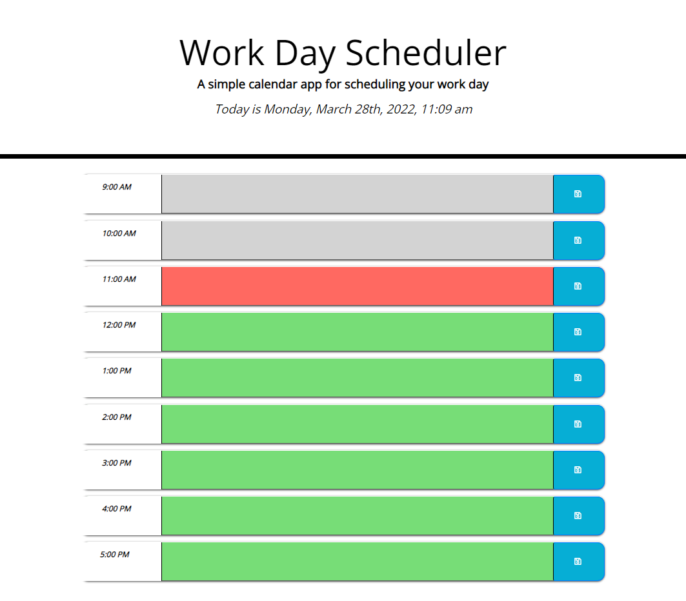

# Vik's Work Day Scheduler

## Description

During any given work day, there is a lot to do! Sometimes it feels like there are never enough hours during the day to get anything done. Given how hectic a day can seem, and how difficult it can be to manage tasks, assignments, and other work-day responsibilities, the best way to prevent that feeling is to schedule out any given work day. A good schedule can help keep items manageable, and allow certain activities to be completed at the right times, freeing up mental bandwidth and limiting stress and anxiety so that a person can focus on the task of the moment.

With that in mind, the purpose of this project is to create a daily planner that allows a user to schedule their activities during the day, separating them into blocks of time. The segmented scheduler can be utilized by anyone, resides entirely online, and includes the following features:

- The scheduler is web-based and can be used by anyone with an internet connection
- The app displays the current date and time at the top of the page
- The user is presented with blocks of time for standard business hours (9am to 5pm)
- The blocks of time are color coded to indicate which hours are in the past, which is the current hour, and which hours are in the future
- The user can click into the time block and can schedule an event
- Once the event is entered, the user can save the event and the item is stored in local storage and persists even if the page is refreshed

By using this app, anyone can simply and effectively manage their time better.

Link to the deployed website: https://vik-maharaj.github.io/work-day-scheduler/

## Installation

The repo contains an index.html file, and assets folder containing a CSS file sytlesheet, an image folder, and a javascript folder. These files were deployed at the above-mentioned link using GitHub Pages. The repo can also be cloned to a local machine and the index.html file can be opened in any web browser or IDE of choice.

## Usage

Using any desktop browser, open the above-mentioned link to view the webpage... and start scheduling your work day activities.

## Credits

Source code courtesy of © 2022 Trilogy Education Services, LLC, a 2U, Inc. brand. Confidential and Proprietary. All Rights Reserved.

Collaborators include the instructor, TAs, and fellow classmates of the UCF Coding Bootcamp (Spring 2022).

## License

Copyright (c) 2022 Vik Maharaj

Permission is hereby granted, free of charge, to any person obtaining a copy of this software and associated documentation files (the "Software"), to deal
in the Software without restriction, including without limitation the rights to use, copy, modify, merge, publish, distribute, sublicense, and/or sell copies of the Software, and to permit persons to whom the Software is furnished to do so, subject to the following conditions:

The above copyright notice and this permission notice shall be included in all copies or substantial portions of the Software.

THE SOFTWARE IS PROVIDED "AS IS", WITHOUT WARRANTY OF ANY KIND, EXPRESS OR IMPLIED, INCLUDING BUT NOT LIMITED TO THE WARRANTIES OF MERCHANTABILITY,
FITNESS FOR A PARTICULAR PURPOSE AND NONINFRINGEMENT. IN NO EVENT SHALL THE AUTHORS OR COPYRIGHT HOLDERS BE LIABLE FOR ANY CLAIM, DAMAGES OR OTHER LIABILITY, WHETHER IN AN ACTION OF CONTRACT, TORT OR OTHERWISE, ARISING FROM, OUT OF OR IN CONNECTION WITH THE SOFTWARE OR THE USE OR OTHER DEALINGS IN THE SOFTWARE.

## Badges

